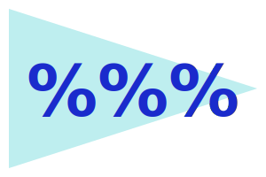
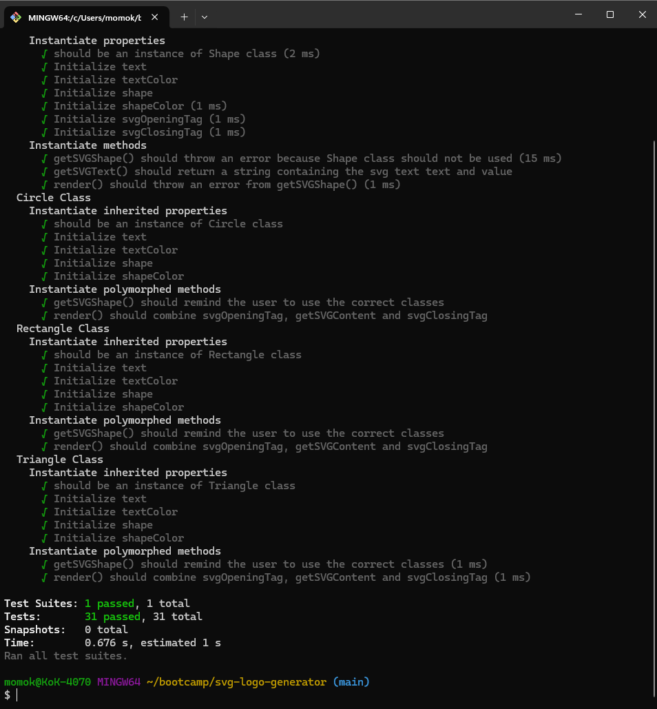

# svg-logo-generator

## Table of content
- readme-generator-CLI
  - [Description](#Description)
  - [Installation](#Installation)
  - [Usage](#Usage)
  - [Tests](#Tests)
  - [Contributing](#Contributing)
  - [License](#License)
  - [Questions](#Questions)
  - [Screenshot](#Screenshot)

## Description
[Demo video](https://drive.google.com/file/d/1sxXX6SR0ZN1YLH8ni8gk_sF3wFQpLEg4/view?usp=drive_link) This is a SVG generator that quickly create a logo.svg. 

## Installation
- The generator requires npm.  [See Node.js installation.](https://docs.npmjs.com/downloading-and-installing-node-js-and-npm)
1. Clone the repo: https://github.com/momokokong/svg-logo-generator
2. In the terminal, move to where the cloned local repo is.
3. `npm install`
   - If it does not automatically install the required module, follow below instructions:
     - `npm i jest`
     - `npm i validator`
     - `npm i inquirer@8.2.4`
4. Ready to use after the modules are installed

## Usage
1. Once the modules are installed, start the generator by `node index.js` in the terminal.
2. Follow the on-screen instructions.
   - It validate user inputs.  For the text it take non-empty string up to 3 characters.  For color it takes 6 digit hexadecimal number.
3. The output logo.svg will be in the folder ./examples/.
4. A video walkthrough: https://github.com/momokokong/svg-logo-generator

## Tests
1. At where the index.js is in the terminal, `npm run test`.
2. It will test the properties and methods of classes in lib/shapes.js
3. Details of the tests locate in lib/shapes.test.js

## Contributing
Contact me.  Find my information in the [Questions](#Questions) section.

## License
This project adopts WTFPL license practices. Check the website for license details: [License: WTFPL](http://www.wtfpl.net/about/)

## Questions
[momokokong's GitHub profile.](https://github.com/momokokong)

[Po Shin Huang Linkedin profile](https://www.linkedin.com/in/poshinhuang/)

## Screenshot
Starting the generator:  

Validates non-empty string up to 3 characters:  

Validates 6 digit hexadecimal number:  

The end:  

 
logo.svg example:
 
Invoke tests  

Test results:  
